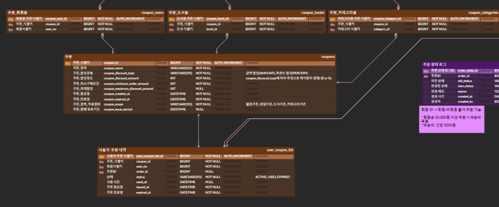
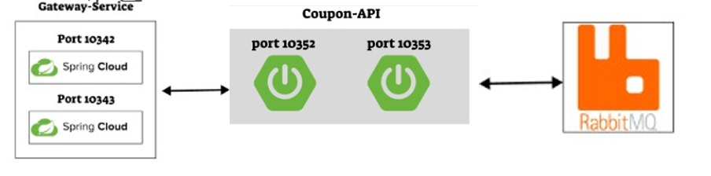
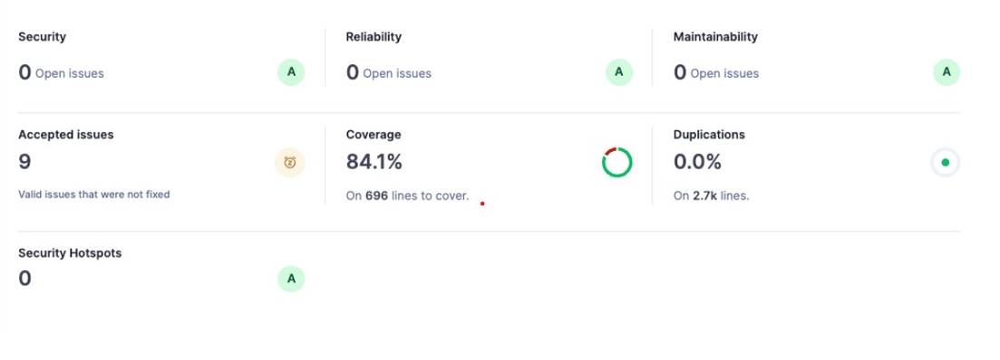

# BookStore Coupon API

NHN 아카데미 팀 프로젝트 **BeanSolid** 온라인 도서 쇼핑몰의 **Coupon API** 모듈입니다.

쿠폰 정책 생성·관리, 사용자 발급·사용·조회 기능을 전담 개발했으며, **DDD 기반 설계**와 **RabbitMQ 비동기 처리 구조**를 적용하여 확장성과 안정성을 강조했습니다.

- **개발 기간**: 2025.06 ~ 2025.07 (2개월)
- **팀 규모**: 7명
- **담당 역할**: Coupon API 전체 설계 및 구현

---

## 기술 스택

**Backend**
- Java 21
- Spring Boot 3.3.4
- Spring Data JPA
- Spring Cloud
- Spring Security

**Database & Cache**
- MySQL
- Redis

**Message Queue**
- RabbitMQ

**Infra & DevOps**
- Docker
- GitHub Actions (CI/CD)
- SonarQube

**기타**
- Swagger, JPA, Lombok

---

## 담당 주요 기능

- 쿠폰 정책 관리 (생성, 수정, 삭제, 조회)
- 사용자 쿠폰 발급·사용·조회 API
- 주문 서비스 연동 할인 금액 계산 로직
- 예외 처리 체계화 (12개 케이스별 에러 코드 및 사용자 안내 메시지 통일)

---

## 데이터베이스 설계 (ERD)

NHN 아카데미 팀 프로젝트 **BeanSolid** 온라인 도서 쇼핑몰의 데이터베이스 설계입니다.  
**DDD(Domain-Driven Design)**를 적용하여 도메인별로 테이블을 명확하게 분리하고, 각 엔티티의 책임을 최소화했습니다.

### 쿠폰 서비스 핵심 테이블 관계

- **`coupons`** — 쿠폰 정책의 생성, 수정, 삭제를 관리하는 핵심 테이블
- **`user_coupon_list`** — 사용자별 쿠폰 발급·사용·만료 이력을 관리
- **`coupon_books`** — 특정 도서 대상 쿠폰 연동
- **`coupon_categories`** — 특정 카테고리 대상 쿠폰 연동
- **`orders`**와의 연동 — 주문 시 쿠폰 적용 여부 및 할인 금액 계산

**설계 포인트**
- 쿠폰과 주문 서비스 간 **느슨한 결합**을 유지하여 확장성 확보
- 쿠폰 상태 관리(`ACTIVE`, `USED`, `EXPIRED`)를 통해 명확한 비즈니스 로직 구현
- 대량의 쿠폰 발급·사용 이력을 효율적으로 처리할 수 있는 구조 설계

---

## Trouble Shooting

### 1. 선착순 쿠폰 발급 요청 집중으로 인한 서버 부하 및 동시성 문제

**문제 상황 (Problem)** 이벤트 시즌 등 특정 시간대에 쿠폰 발급 요청이 일시에 폭주할 경우, DB 커넥션 고갈 및 API 응답 지연으로 인해 전체 쇼핑몰 서비스가 마비될 우려가 있었습니다.

**해결 방안 (Solution)** - **서비스 인스턴스 다중화 (Scale-out):** `Coupon-API` 서버를 다중화(Port 10352, 10353)하고 `Spring Cloud Gateway`를 통해 트래픽을 로드 밸런싱하도록 구성했습니다.
- **메시지 큐 기반 비동기 처리:** 대량의 발급 요청을 `RabbitMQ` 큐에 즉시 적재하여 클라이언트에게는 빠른 응답을 반환하고, 실제 발급 로직은 백그라운드에서 비동기적으로 안전하게 처리했습니다.

**결과 (Result)** - 요청 집중 시에도 코어 서비스의 CPU/메모리 부하를 안정적인 수준으로 유지했습니다.
- 부하 테스트를 통해 대규모 트래픽 환경에서도 누락 없는 안정적인 쿠폰 발급 흐름을 검증했습니다.

---

## 코드 품질 관리 (Code Quality)

정적 분석 도구인 **SonarQube**를 도입하여 지속적으로 코드 스멜을 제거하고, 엄격한 테스트 코드를 작성함으로써 프로젝트의 안정성과 유지보수성을 극대화했습니다.

### 주요 분석 지표
- **Test Coverage (테스트 커버리지)**: **84.1%** (`696 lines`) 확보
  - 비즈니스 로직이 집중된 Service 레이어와 예외 처리 케이스(12개 에러 코드)에 대한 단위 테스트 및 통합 테스트를 철저히 수행했습니다.
- **Duplications (코드 중복률)**: **0.0%** (`2.7k lines`)
  - 공통 로직을 static 메서드나 별도 컴포넌트로 분리하고, 구조적인 리팩토링을 통해 중복 코드를 완벽하게 제거했습니다.
- **3대 보안/신뢰성 지표 올 A 등급 (All A Grades)**
  - **Security (보안성)**: `A` (Open Issues 0개, Security Hotspots 0개)
  - **Reliability (신뢰성)**: `A` (Open Issues 0개)
  - **Maintainability (유지보수성)**: `A` (Open Issues 0개)

---

## 회고 및 학습

이번 쿠폰 서비스 개발을 통해 단순 기능 구현을 넘어 **확장성, 유지보수성, 트래픽 대응**을 고려한 설계의 중요성을 깊이 깨달았습니다.

특히 RabbitMQ를 활용한 비동기 처리 경험은 대규모 서비스에서 반드시 필요한 역량임을 실감한 계기가 되었으며, 팀원들과의 코드 리뷰와 협업을 통해 더 나은 아키텍처를 함께 만들어가는 경험을 할 수 있었습니다.
